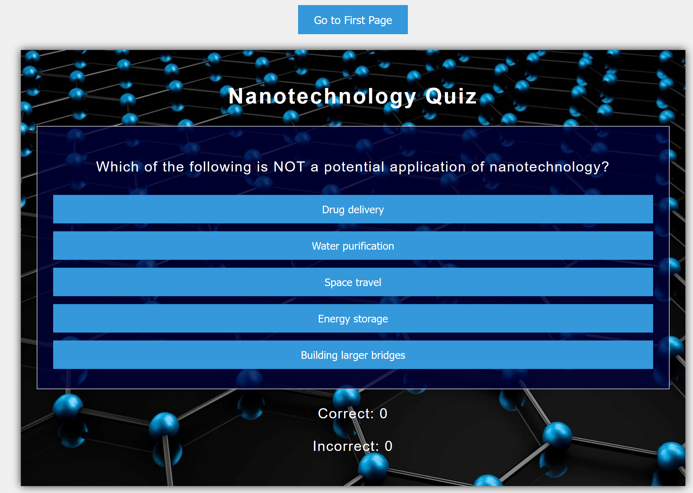
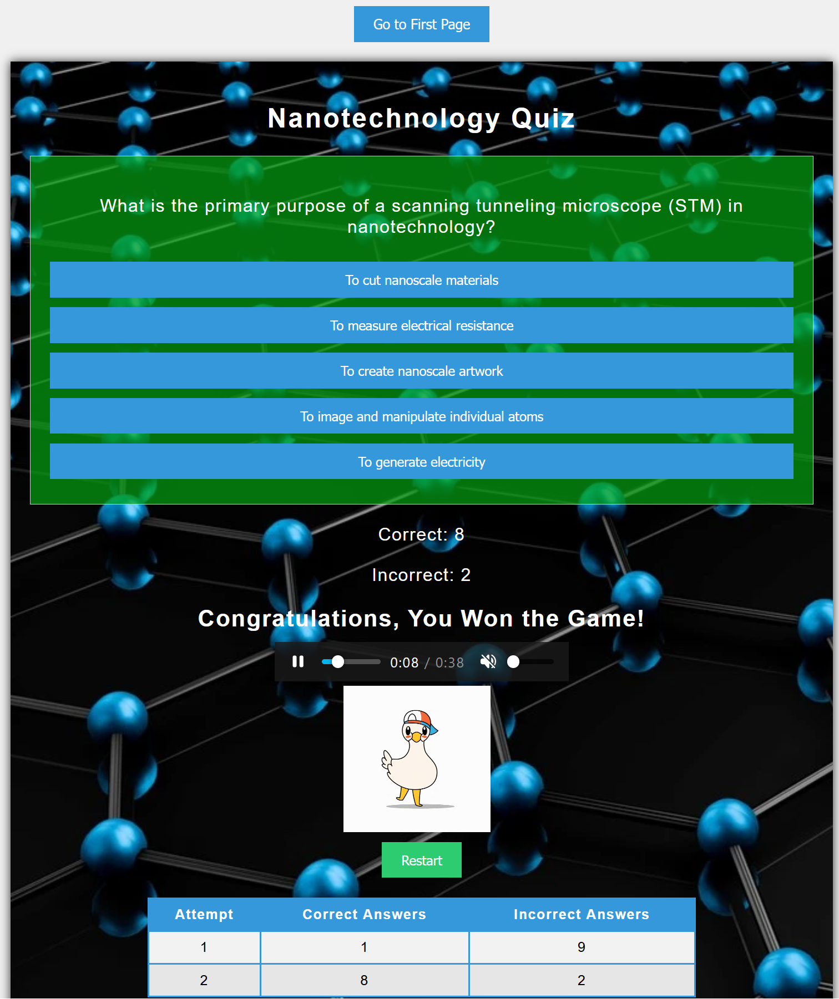
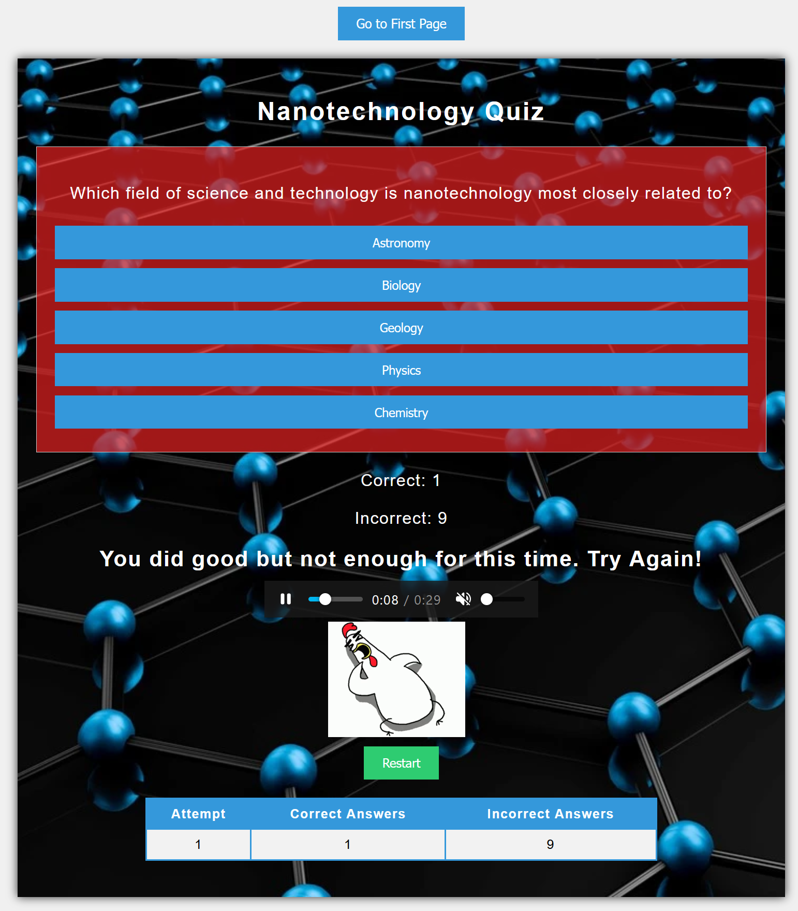

# Nanotechnology Quiz

This is a quiz game that you can test your knowledge in the field of Nanotechnology. In the first page you can find the instruction about how many questions are in the quiz and how many questions you need to answer correctly to win the quiz. By tracking your scores over time, you can challenge yourself to improve your performance and continue learning.

The live link can be found here - <https://teman67.github.io/Project_2/index.html>

### Existing Features

- __The welcome page__

  - On the welcome page, you'll find an instruction about the game. It is clear for users that they need to answer at least 6 question correctly to win the game.
  - Users can see what will happen after ending the game, including playing a song, showing a chicken icon and a table that record their attempts.
  - Users can go to the quiz page by clicking the "Go to Quiz Page" button.

- __The Quiz Page__
  
  - On top of the page there is a button that user can go back to the welcome page.
  - Here, the questions are displayed and a user can select the correct answer from 5 available options.
  - If the user select the correct answer then the Correct score increases otherwise the Incorrect score increases.
  - When the user answers to 10 questions, if they answer to at least 6 questions correctly, then a happy song plays and a happy chicken dances. While, if the user cannot win the quiz a sad song plays and a sad chicken shows at the bottom of the page.
  - The song is muted and the user can unmute the song.
  - A table is also displayed after each participation and the user can track his/her scores.
  - Each time that the user Restart the quiz, the questions are suffled.
  

## Testing

- I have checked the website on different screen sizes and it works well.
- The webpage works well when I used Google chrome, Firefox, Opera, and Microsoft Edge web browsers.
- The outcome of the quiz is always correct and I tested different scenarios to confirm it.
- I confirm that the quiz questions are easy to read and the contrast is good enough.

### Validator Testing

- HTML
  - No errors were returned when passing through the official
- CSS
  - No errors were found when passing through the official

  - The Google Chrome lighthouse tool was used to check the website and the scores for each pages are shown bellow:
  - 
  - 
  - 

### Unfixed Bugs

When I use media query for cellphone size, in the home page, the first green bullet point goes to the right side of the screen in google chrome while in firefox it is in a correct side. I have checked different parameters in my css styling but I could not solve it. I also searched on google and stack overflow and still the isuue was not solved.

## Deployment

- The site was deployed to GitHub pages. The steps to deploy are as follows:
  - In the GitHub repository, navigate to the Settings tab
  - From the source section drop-down menu, select the Master Branch
  - Once the master branch has been selected, the page will be automatically refreshed with a detailed ribbon display to indicate the successful deployment.

The live link can be found here - <https://teman67.github.io/Project-1/index.html>

### Content

- The images of the website were tooken from google images.
- The video on the home page was downloaded from Youtube (<https://www.youtube.com/watch?v=xW8Oocswn9s>) and then edited by KAPWING online website.
- The icons in the footer and Activities page were taken from [Font Awesome](https://fontawesome.com/).
- The fonts are imported from Google Fonts.
- The Readme.md template was obtained from Code Institute.
